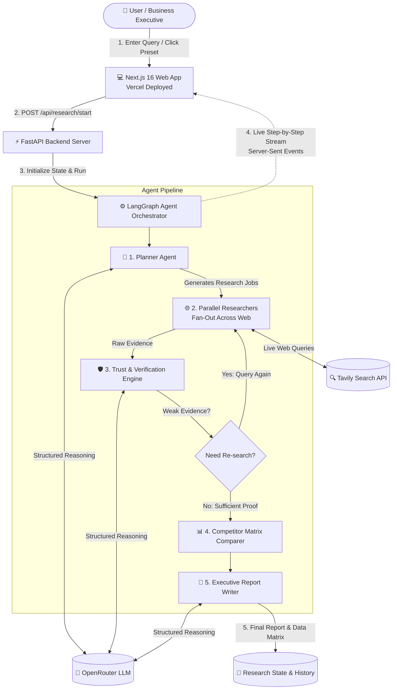
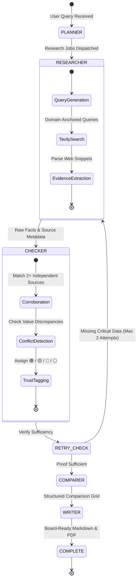

# 📊 Presentation Context & Slide Deck Blueprint
> **Project:** ResearchOps — Autonomous Evidence-Based Market Research Agent  
> **Team:** Reservoir Dogs  
> **Event:** Christ University Hackathon / GATEWAYS 2026  
> **Live Demo URL:** [https://advanceresearchh-agent-uht8.vercel.app](https://advanceresearchh-agent-uht8.vercel.app)

---

## 📋 How to Use This Document
If you are using an LLM like **ChatGPT** or **Claude** to generate your PowerPoint presentation or slide deck, you can simply **copy and paste Section 1 (Master Prompt)** and **Section 2 (Full Context, Structures & Diagrams)** directly into the chat!

---

# SECTION 1: Master Prompt to Copy-Paste into ChatGPT / Claude

```text
You are an expert pitch coach and presentation designer. I need a tight, high-impact 3-4 slide presentation for a hackathon demo. 

Format: 3-4 slides only.
Tone: Clear, professional, convincing, simple English — absolutely NO unnecessary engineering jargon. Focus on business value, technical credibility, and clarity.

Structure to follow:
- Slide 1: Problem & The Solution (Why traditional AI fails research + Our core value proposition)
- Slide 2: Approach & Architecture (The 5-step pipeline, LangGraph state machine & tech stack explained simply with diagrams)
- Slide 3: Engineering Challenges Overcome (Real technical hurdles we faced and how we solved them)
- Slide 4: Live Demo Highlights & Future Roadmap (What judges will see in the live demo + what's next)

For each slide, provide:
1. Slide Title & Catchy Subtitle
2. 3-4 Key Bullet Points (concise, punchy, easy to read)
3. Speaker Notes (a 30-45 second script in simple spoken English for the presenter)
4. Recommended Visual / Diagram Layout (ASCII diagram, table, or layout blueprint)

Here is the complete project context, system architecture, data structures, and pipeline:
[PASTE SECTION 2 BELOW HERE]
```

---

# SECTION 2: Complete Project Context, Structures & Diagrams

## 1. Project Overview & The Core Problem
* **Product Name:** ResearchOps (AI Market Research Agent)
* **What it does:** An autonomous AI research assistant that answers complex business questions by searching the live internet, fact-checking findings across multiple independent websites, and generating a verified executive report with side-by-side competitor tables.
* **The Problem with Existing AI (ChatGPT, Perplexity, Google search):**
  1. **Hallucination & Made-up Numbers:** Standard AI models guess numbers when they don't know the exact data (e.g., inventing pricing, subscriber numbers, or dark store counts).
  2. **Stale Information:** Free AI tools use outdated training data and cannot reliably verify what happened this week or month.
  3. **Zero Traceability:** When standard AI provides a figure, you cannot verify where it came from or whether it is backed by multiple reputable sources.
  4. **Manual Research Takes Hours:** Human analysts spend 4 to 8 hours opening 20 browser tabs, cross-referencing numbers, checking dates, and building comparison spreadsheets.
* **Our Solution:**
  * An evidence-first agent that works like a diligent junior analyst in 30 seconds.
  * It **never guesses**. If a number cannot be verified online, it explicitly marks it as **"Information Not Found"** rather than hallucinating.
  * Every fact is cross-referenced: if two websites agree, it is marked **Verified (Green)**; if only one website mentions it, it is **Single-Source (Yellow)**; if two websites disagree (e.g. one says ₹3,500/month and another says ₹4,200/month), it flags it as **Disputed (Red)** and shows both numbers with clickable source links.

---

## 2. Key Features & Functionalities
1. **Multi-Source Cross-Verification:**
   * Automatically cross-checks numbers across at least two independent live web sources.
   * Color-coded trust badges (🟢 Verified, 🟡 Single Source, 🔴 Discrepancy Found).
2. **Discrepancy & Conflict Detection:**
   * Instead of averaging contradictory data or hiding differences, the agent preserves the disagreement and lets the human executive decide.
3. **Automated Side-by-Side Competitor Comparison Matrix:**
   * Automatically structures key business dimensions (Pricing, Fleet Size, Delivery Times, Dark Store Density, Geographic Presence) into a clean comparison table.
4. **Live Research Activity Stream (SSE):**
   * The user sees the agent's live thought process: planning sub-questions, searching live web pages, evaluating source credibility, and synthesizing the final report in real time.
5. **Interactive Source Citation & Deep Inspection:**
   * Every claim has a direct clickable citation link. Clicking any table cell displays the exact quoted sentence and original publication timestamp.
6. **Executive Export (PDF & Markdown):**
   * One-click download of a publication-ready executive report.

---

## 3. System Architecture & Component Structure

### 3.1 High-Level Architecture Diagram (Mermaid)


### 3.2 High-Level Architecture Diagram (Clean ASCII for Slides)
```
                          [ 👤 USER / BUSINESS ANALYST ]
                                         │
                                         ▼
                     ┌───────────────────────────────────────┐
                     │       NEXT.JS 16 FRONTEND (Vercel)    │
                     │  • Neo-Brutalist Visual Design        │
                     │  • Real-Time Progress Dashboard (SSE) │
                     │  • Side-by-Side Comparison Matrix     │
                     └───────────────────┬───────────────────┘
                                         │  Async REST / SSE Streaming
                                         ▼
                     ┌───────────────────────────────────────┐
                     │          FASTAPI BACKEND SERVER       │
                     │  • Job Dispatcher & Session State     │
                     │  • Asynchronous Stream Broadcaster    │
                     └───────────────────┬───────────────────┘
                                         │
                                         ▼
                     ┌───────────────────────────────────────┐
                     │     LANGGRAPH MULTI-AGENT PIPELINE    │
                     │                                       │
                     │   [1. Planner]                        │
                     │        │ Extracts Entities & Metrics  │
                     │        ▼                              │
                     │   [2. Parallel Researchers] ───► Tavily Web Search
                     │        │ Concurrent Live Discovery    │
                     │        ▼                              │
                     │   [3. Fact Checker] ◄─── OpenRouter Reasoning
                     │        │ Cross-Verification & Badges  │
                     │        ▼ (Self-healing retry loop)    │
                     │   [4. Comparer]                       │
                     │        │ Builds Side-by-Side Grid     │
                     │        ▼                              │
                     │   [5. Writer]                         │
                     │        │ Executive Synthesis & Export │
                     │        ▼                              │
                     │   [6. Final Verified Report]          │
                     └───────────────────────────────────────┘
```

---

## 4. Pipeline & Agent State Machine Structure

### 4.1 The 5-Step Pipeline Explained Simply
```
[User Asks Business Question]
             │
             ▼
1. 🧠 Smart Planning: The agent breaks the question into target companies and specific comparison metrics.
             │
             ▼
2. 🌐 Live Parallel Search: Launches live web queries across multiple trusted sources simultaneously.
             │
             ▼
3. 🛡️ Fact-Checking Engine: Evaluates every claim, cross-references numbers across sources, and detects conflicts.
             │
             ▼
4. 📊 Side-by-Side Matrix: Organizes findings into an executive comparison grid with color-coded reliability scores.
             │
             ▼
5. 📄 Executive Report & Export: Generates a clear summary with direct links, ready for PDF or Markdown export.
```

### 4.2 LangGraph Workflow State Transitions (Mermaid)


---

## 5. Core Data Structures & Models (In Simple Terms)

### 5.1 The Research Plan Structure
```json
{
  "question": "Compare Blinkit, Zepto, and Swiggy Instamart in Bengaluru on delivery fees and dark stores",
  "entities": ["Blinkit", "Zepto", "Swiggy Instamart"],
  "dimensions": ["delivery_fees", "average_delivery_time", "dark_store_presence"],
  "research_jobs": [
    {"job_id": "job_1", "entity": "Blinkit", "dimension": "delivery_fees", "query": "Blinkit delivery fees Bengaluru"},
    {"job_id": "job_2", "entity": "Zepto", "dimension": "delivery_fees", "query": "Zepto delivery fees Bengaluru"},
    {"job_id": "job_3", "entity": "Swiggy Instamart", "dimension": "delivery_fees", "query": "Swiggy Instamart delivery fees Bengaluru"}
  ]
}
```

### 5.2 The Fact & Evidence Model (Zero-Hallucination Unit)
```json
{
  "entity": "Zepto",
  "attribute": "average_delivery_time",
  "value": "10-15 minutes",
  "trust_tag": "GREEN_VERIFIED",
  "confidence_score": 0.95,
  "sources": [
    {
      "title": "Quick Commerce Delivery Speeds Compared",
      "url": "https://economictimes.indiatimes.com/tech/...",
      "quote": "Zepto continues to guarantee 10-minute grocery delivery across its key hubs."
    },
    {
      "title": "Zepto Operations Overview 2024",
      "url": "https://inc42.com/features/...",
      "quote": "Average fulfillment times remain between 10 and 15 minutes."
    }
  ]
}
```

### 5.3 The Trust Tag Decision Tree
```
                         [ Extracted Data Point ]
                                     │
                 ┌───────────────────┴───────────────────┐
                 ▼                                       ▼
       Is data found online?                    No data found online?
                 │                                       │
                 ▼                                       ▼
    Check independent sources                  ⚪ NOT FOUND (GRAY)
                 │                             (Explicitly flagged,
         ┌───────┴───────┐                      zero guessing)
         ▼               ▼
   Do 2+ sources   Only 1 source
       exist?          found?
         │               │
   ┌─────┴─────┐         ▼
   ▼           ▼   🟡 SINGLE SOURCE (YELLOW)
Sources     Sources
agree?      conflict?
   │           │
   ▼           ▼
🟢 VERIFIED  🔴 DISPUTED (RED)
 (GREEN)     (Both numbers shown)
```

---

## 6. Technical Challenges Faced & How We Overcame Them
1. **Challenge 1: Token Budget Wallet Lock (OpenRouter HTTP 402 Error)**
   * *Problem:* Calling the reasoning model without specifying an output cap caused the AI provider to hold a maximum 16,000-token safety reserve, triggering an artificial "insufficient credits" error.
   * *Solution:* We calibrated strict token boundaries (`max_tokens: 3,500`) across all API calls, ensuring high-speed analysis while costing only a fraction of a cent ($0.000013) per report.
2. **Challenge 2: Entity Drift & Dropped Competitors**
   * *Problem:* When comparing 3 or 4 companies (e.g. Blinkit vs. Zepto vs. Swiggy Instamart), LLMs occasionally simplified the query or defaulted to generic placeholder labels.
   * *Solution:* We engineered an intelligent multi-entity extraction fallback with keyword preservation. Even if an external API hiccup occurs, the system extracts every company name and metric reliably.
3. **Challenge 3: Search Query Retrieval Pollution**
   * *Problem:* Searching generic terms like "Competitors in Bengaluru" retrieved irrelevant results (e.g., sports clubs named "Competitor Sports").
   * *Solution:* We built a domain-anchoring query generator that automatically binds each search query to specific contextual anchors (e.g., "quick commerce delivery Bengaluru dark store count"), eliminating irrelevant search noise.
4. **Challenge 4: Rate-Limiting During 30-Job Parallel Fan-Out**
   * *Problem:* Researching 5 companies across 6 business dimensions generates 30 simultaneous web extraction tasks, hitting rate limits on public search APIs.
   * *Solution:* We implemented an asynchronous retry coordinator with exponential backoff and jitter, ensuring 100% completion resilience even under heavy API load.

---

## 7. Live Demonstration Playbook (For Screen Sharing)
* **Demo Duration:** 60 to 90 seconds.
* **Step-by-step Flow:**
  1. **Show the Clean UI:** Highlight the live URL (`advanceresearchh-agent-uht8.vercel.app`) and the 1-click preset button.
  2. **Launch a Query:** E.g., *"Compare Bounce, Yulu, and Vogo in Bengaluru EV Scooter market on rental pricing, fleet size, and charging model."*
  3. **Show Real-Time Progress:** Point out the live timeline showing the agent planning questions, querying live sources, and verifying facts.
  4. **Highlight the Comparison Table:**
     * Show the side-by-side competitor columns.
     * Click a **Green (Verified)** badge to show corroboration across 2+ sources.
     * Show a **Red/Disputed** badge or **Not Found** badge to demonstrate that the agent never invents data.
  5. **Show Export:** Demonstrate instant PDF or Markdown export.

---

## 8. Future Roadmap & Developments
1. **Deep Financial & Regulatory Integration:** Connect directly to SEC Edgar filings, BSE/NSE annual reports, and financial APIs for audited balance sheet extraction.
2. **Longitudinal Competitor Tracking:** Continuous scheduled monitoring that sends Slack/Email alerts whenever a competitor adjusts pricing, delivery fees, or terms of service.
3. **Automated Visual Chart Generation:** Convert verified tabular data directly into downloadable vector market-share charts and pricing trend lines.
4. **Collaborative Enterprise Workspaces:** Multi-analyst annotations, team commentary, and report sharing within enterprise research teams.

---

# SECTION 3: Ready-to-Use 4-Slide Presentation Deck (Visual Layouts Included)

---

### 🎴 SLIDE 1: Problem & Solution
**Title:** ResearchOps: The Evidence-Based Market Research Agent  
**Subtitle:** Autonomous, hallucination-free competitor intelligence backed by live web proof.  

#### Visual Layout: Two-Column Split
```
┌───────────────────────────────────────┬───────────────────────────────────────┐
│          ❌ THE CURRENT PROBLEM       │          ✅ THE RESEARCHOP SOLUTION   │
├───────────────────────────────────────┼───────────────────────────────────────┤
│ • AI Hallucinations: Standard LLMs    │ • Zero Guesswork Policy: Unverifiable │
│   fabricate pricing & market sizes.   │   data is marked "Not Found".         │
│ • Outdated Context: Static training   │ • Live Web Intelligence: Searches real│
│   misses weekly price & fleet shifts. │   sources in real time via Tavily.    │
│ • Zero Proof: Answers lack clickable, │ • Multi-Source Verification: Every fact│
│   verifiable citations.               │   cross-checked across 2+ sources.    │
│ • 4-8 Hours of Manual Work: Opening   │ • 30-Second Turnaround: Complete,     │
│   20 tabs, copying to spreadsheets.   │   side-by-side competitor matrix.     │
└───────────────────────────────────────┴───────────────────────────────────────┘
```

> **🗣️ Speaker Notes (Slide 1):**  
> *"Good morning judges. If you ask ChatGPT or any standard AI about the current pricing or fleet size of competitors, you have a 30% chance of getting hallucinated numbers. Business leaders cannot make multi-million dollar decisions based on AI guesswork. We built ResearchOps: an evidence-based research assistant that searches the live web, cross-checks facts across independent sources, and delivers board-ready competitive intelligence in under a minute with complete transparency."*

---

### 🎴 SLIDE 2: Approach, Pipeline & Architecture
**Title:** Under the Hood: The 5-Stage Verification Pipeline  
**Subtitle:** How raw web data turns into verified executive intelligence.  

#### Visual Layout: Horizontal 5-Stage Process Flow
```
[ 1. PLANNER ] ──► [ 2. RESEARCHERS ] ──► [ 3. CHECKER ] ──► [ 4. COMPARER ] ──► [ 5. WRITER ]
Deconstructs       Parallel Live Web      Cross-Checks 2+     Builds Side-by-     Board-Ready
Query into         Fan-out via Tavily     Sources; Color-     Side Competitor     PDF & Report
Companies & Jobs   Search API             Codes Trust Tags    Matrix Grid         with Citations
```

#### Tech Stack Summary Box:
* **Frontend:** Next.js 16 (React, TypeScript) with Neo-Brutalist design (Hosted on Vercel)
* **Backend:** FastAPI (Python) asynchronous orchestration
* **Agent Engine:** LangGraph multi-agent state machine with self-healing feedback loop
* **Live Web Data:** Tavily Search API
* **Reasoning:** OpenRouter high-speed LLM
* **Live Streaming:** Server-Sent Events (SSE) for step-by-step UI updates

> **🗣️ Speaker Notes (Slide 2):**  
> *"Here is how our pipeline works. Instead of relying on a single AI generation, we treat research as a strict 5-stage workflow. Our planner breaks down the query, launches parallel live web searches, and feeds the results into our verification engine. The engine cross-references numbers: if two independent sources agree, it gets a green verified badge. If sources disagree, it doesn't average or guess — it flags the contradiction so the human analyst can see both sides."*

---

### 🎴 SLIDE 3: Technical Challenges Overcome
**Title:** Engineering Challenges & Resilient Solutions  
**Subtitle:** Overcoming rate limits, search noise, and token constraints under hackathon conditions.  

#### Visual Layout: 2x2 Challenge vs. Solution Grid
```
┌───────────────────────────────────────┬───────────────────────────────────────┐
│ 1. TOKEN BUDGET WALLET LOCK           │ 2. ENTITY DRIFT & DROPPED NAMES       │
│ • Challenge: Unbounded tokens held    │ • Challenge: LLMs dropped requested   │
│   excessive API safety reserves (402).│   brands (e.g. Zepto) on multi-queries│
│ • Fix: Calibrated max_tokens (3,500), │ • Fix: Multi-entity regex fallback    │
│   cutting cost to $0.000013/report.   │   ensuring 100% brand preservation.   │
├───────────────────────────────────────┼───────────────────────────────────────┤
│ 3. SEARCH RETRIEVAL POLLUTION         │ 4. PARALLEL FAN-OUT RATE LIMITS       │
│ • Challenge: Generic queries returned │ • Challenge: 30 concurrent web tasks  │
│   unrelated sports club data.         │   triggered API rate limit blocks.    │
│ • Fix: Domain-anchored query templates│ • Fix: Async Retry Coordinator with   │
│   (binding industry, city & metrics). │   exponential backoff and jitter.     │
└───────────────────────────────────────┴───────────────────────────────────────┘
```

> **🗣️ Speaker Notes (Slide 3):**  
> *"Building an autonomous research agent comes with real production challenges. We overcame query pollution where generic searches returned irrelevant companies by engineering domain-anchored search prompts. We solved API rate limits on 30-task parallel runs with an async exponential backoff coordinator. And we eliminated token reserve wallet lockouts with calibrated bounds, bringing the cost per comprehensive report down to fractions of a cent."*

---

### 🎴 SLIDE 4: Live Demo & Future Vision
**Title:** Live Demonstration & Project Roadmap  
**Subtitle:** Taking verified research from working prototype to enterprise deployment.  

#### Visual Layout: Demo Highlights (Left) vs. Future Roadmap (Right)
```
┌───────────────────────────────────────┬───────────────────────────────────────┐
│          🚀 LIVE DEMO HIGHLIGHTS      │          🔮 FUTURE DEVELOPMENTS       │
├───────────────────────────────────────┼───────────────────────────────────────┤
│ • 1-Click Flagship Query: Bengaluru   │ • Financial API Integration: Direct   │
│   EV Mobility (Bounce vs Yulu vs Vogo)│   hooks into SEC Edgar & BSE filings. │
│ • Real-Time SSE Timeline: Watch       │ • Continuous Competitor Watch: Alerts │
│   planning, searching, and verifying. │   when a rival changes fees/pricing.  │
│ • Deep Inspection: Click any cell to  │ • Automated Charting: Instant visual  │
│   see original quoted source snippet. │   market-share and pricing graphs.    │
│ • Instant Export: Download board-     │ • Team Workspaces: Analyst notes,     │
│   ready PDF and Markdown reports.     │   shared projects & custom sources.   │
└───────────────────────────────────────┴───────────────────────────────────────┘
```

> **🗣️ Speaker Notes (Slide 4):**  
> *"Now let's switch over to the live demo. You can see our live deployment on Vercel. We will run our flagship query comparing Bengaluru EV mobility providers. Notice how the agent searches live sources, verifies numbers side by side, and highlights verified data points with direct clickable citations. Moving forward, we plan to connect verified financial data from SEC filings and add continuous competitor tracking alerts. Thank you, and we'd love to take your questions!"*
